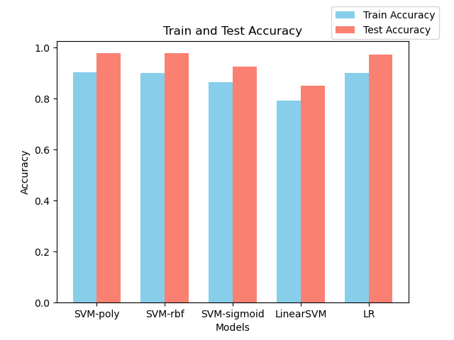
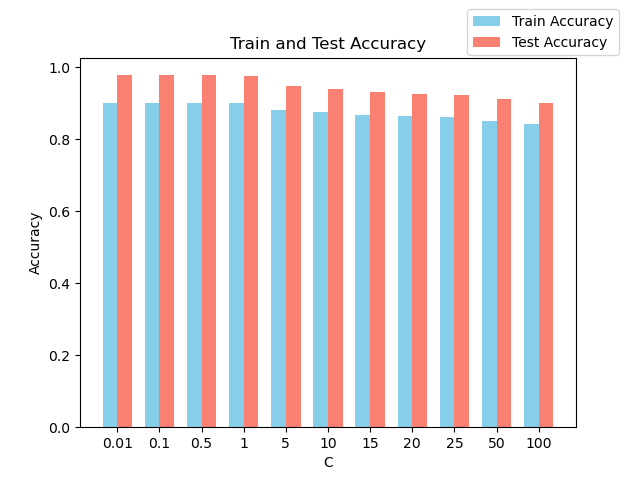
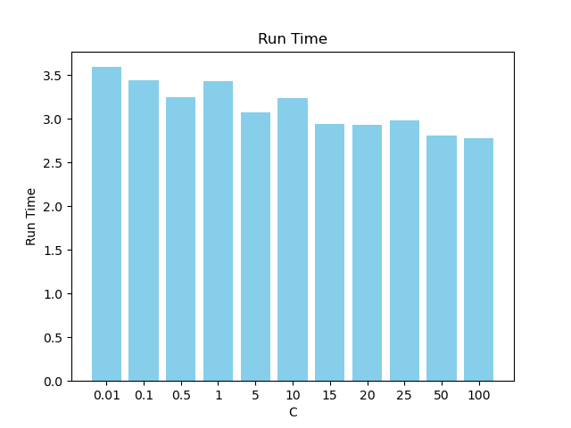
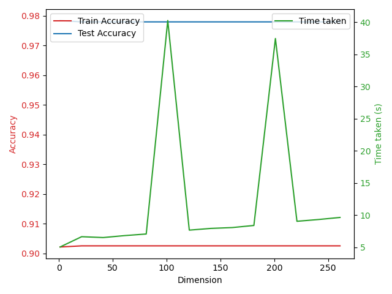

# 2024 Spring AI PJ1

21302010042 
侯斌洋

---

## 1. 数据读取

见 ```main.py/data_preprocess```，已完成。

## 2. 实现 LRModel 和 LinearSVMModel

见 ```main.py/LRModel``` & ```main.py/LinearSVMModel```，已完成。

## 3. 比较 SVM ，LinearSVM 和 LR。

见 ```analysis/compare.py```，数据为本地跑出的结果。（控制 C 为默认值 20）

{:height="60%" width="60%"}

{:height="60%" width="60%"}

从上图可以看出，**LR** 准确率最高，运行时间最短，在本次实验中表现最好。**LinearSVM** 准确率最低，运行世界也较长，表现最差。另外3个 **SVM** 算法在准确率上差别不大，但在运行时间上有较大差别。

## 4. 分析 SVM 核函数的影响。

通过上图可以看出，在控制C为20的情况下，在本次实验中，**poly** 和 **rbf** 核函数准确率较高，**sigmoid**稍低，**linear**最低。在运行时间上，**sigmoid < linear < rbf < poly**。
因此综合准确率和运行时间来看，**rbf** 核函数表现最好。

## 5. 分析 SVM 正则化系数的影响。

控制核函数为 **sigmoid**。

{:height="60%" width="60%"}

{:height="60%" width="60%"}

可以看出，正则化系数对准确率和运行时间都有较为显著的影响，随着C的增大，大致趋势为准确率逐渐下降，运行时间逐渐下降。在本次实验中，若使用sigmoid核函数，则C应设为小于等于1的数，以获得较好的准确率。


## 6. 特征工程

这里对助教给出的特征进行降维，使用 **PCA** 方法。见 ```feature_engineering.py```。

以下是使用 **PCA** 降维后的结果 ==(SVM rbf)==

```shell
Dimension: [1, 21, 41, 61, 81, 101, 121, 141, 161, 181, 201, 221, 241, 261]
Train Accuracy: [0.9021180886197333, 0.9024953662415559, 0.9024953662415559, 0.9024953662415559, 0.9024953662415559, 0.9024953662415559, 0.9024953662415559, 0.9024953662415559, 0.9024953662415559, 0.9024953662415559, 0.9024953662415559, 0.9024953662415559, 0.9024953662415559, 0.9024953662415559]
Test Accuracy: [0.9783672271651311, 0.9779068316873651, 0.9779068316873651, 0.9779068316873651, 0.9779068316873651, 0.9779068316873651, 0.9779068316873651, 0.9779068316873651, 0.9779068316873651, 0.9779068316873651, 0.9779068316873651, 0.9779068316873651, 0.9779068316873651, 0.9779068316873651]
Time taken: [5.0683324337005615, 6.666937828063965, 6.532778024673462, 6.83823037147522, 7.085592269897461, 40.27690362930298, 7.689087152481079, 7.9545512199401855, 8.088777542114258, 8.413077116012573, 37.477004528045654, 9.062399625778198, 9.338968515396118, 9.659477472305298]
```

{:height="60%" width="60%"}

上面的两个运行时间异常值推测是由于在本地运行时，内存不足导致的。单独运行这两个点时，不会出现这种异常情况，而是基本符合整体的趋势。

可以看出，在进行PCA降维后，准确率基本上没有什么变化，但运行时间显著减少。说明原始数据中有很多冗余特征，通过PCA降维可以提高运行效率。降维后准确率没什么变化，推测是由于SVM是一种基于边界的分类器，如果降维后的数据仍然保留了原始数据的主要特征和结构，那么SVM可能仍然能找到一个类似的超平面来进行分类。因此准确率不变。

