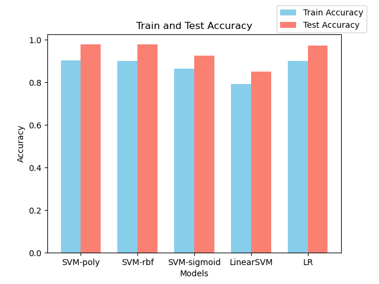
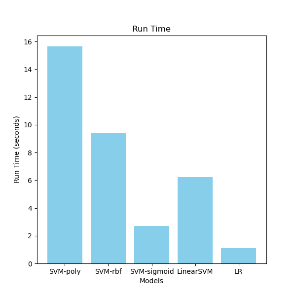
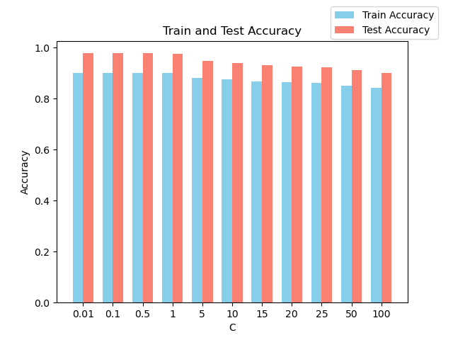
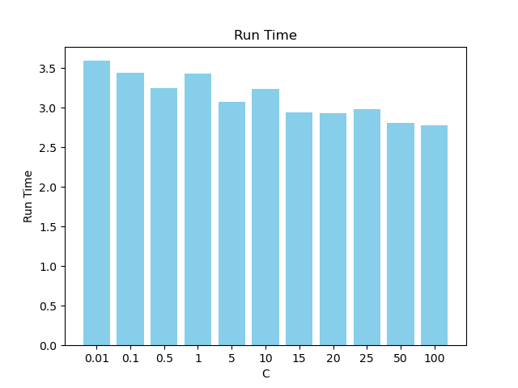

# 2024 Spring AI PJ1

21302010042 
侯斌洋

---

## 1. 数据读取

见 main.py/data_preprocess，已完成。

## 2. 实现 LRModel 和 LinearSVMModel

见 main.py/LRModel & main.py/LinearSVMModel，已完成。

## 3. 比较 SVM ，LinearSVM 和 LR。

见 analysis/compare.py，数据为本地跑出的结果。（控制 C 为默认值 20）

从上图可以看出，LR 准确率最高，运行时间最短，在本次实验中表现最好。LinearSVM准确率最低，运行世界也较长，表现最差。另外3个SVM算法在准确率上差别不大，但在运行时间上有较大差别。

## 4. 分析 SVM 核函数的影响。

通过上图可以看出，在控制C为20的情况下，在本次实验中，poly和rbf核函数准确率较高，sigmoid稍低，linear最低。在运行时间上，sigmoid < linear < rbf < poly。
因此综合准确率和运行时间来看，rbf核函数表现最好。

## 5. 分析 SVM 正则化系数的影响。

控制核函数为sigmoid。

可以看出，正则化系数对准确率和运行时间都有较为显著的影响，随着C的增大，大致趋势为准确率逐渐下降，运行时间逐渐下降。在本次实验中，若使用sigmoid核函数，则C应设为小于等于1的数，以获得较好的准确率。

## 6. 特征工程

...
