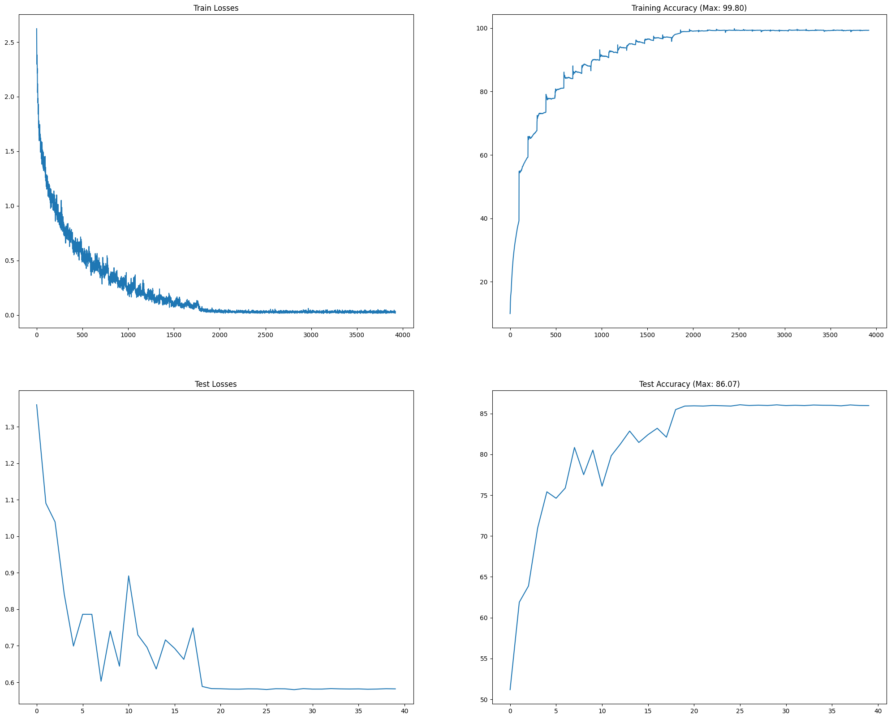
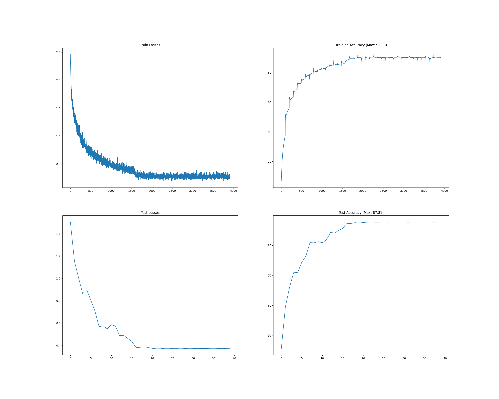
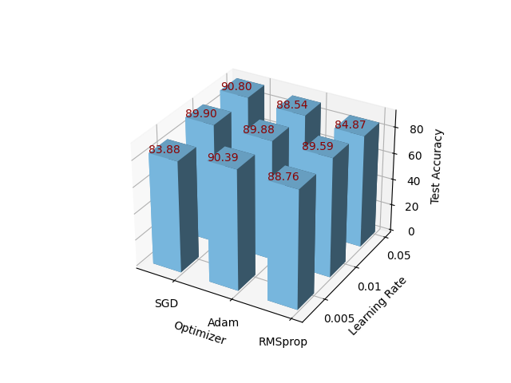
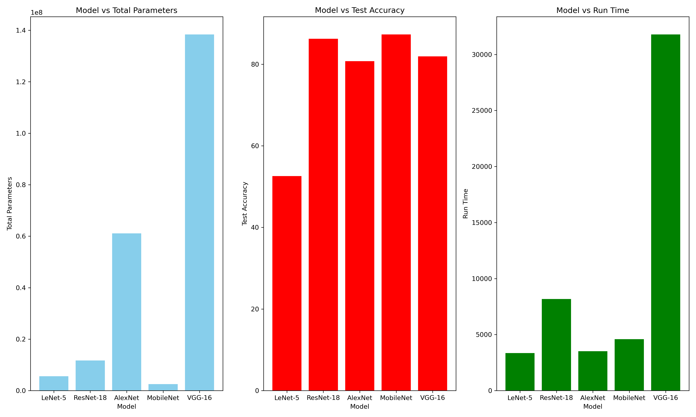

# 2024 Spring AI PJ2

21302010042
侯斌洋

---

## 1. Resnet-18模型的训练和测试

> 实现：``main.py``。

* 由于`forward`过程中已经计算了`softmax`：
```python
return F.log_softmax(out, dim=-1)
```
* 故这里使用`nll_loss`

```python
# model_training()
optimizer.zero_grad()
y_pred = model(data)
# 由于已经计算了log_softmax，所以这里使用nll_loss
loss = F.nll_loss(y_pred, target)
loss.backward()
optimizer.step()

# model_testing()
output = model(data)
test_loss += F.nll_loss(output, target, reduction='sum').item()
```

> 运行结果：`result/res1_base`

.log文件为控制台输出记录，.png文件为过程可视化图。



## 2. 设计数据增强

> 实现：`main.py`文件。

* 由`1. Resnet-18模型的训练和测试` 中的结果可以看出，网络存在过拟合问题，训练准确率要远远高于测试准确率，且逼近100%。因此，数据增强应该能在一定程度上减少过拟合现象，提高准确率。 

* 在这里我对训练集进行了50%概率水平翻转、-10°~10°的随机旋转、以及随机裁剪图像为原来的0.9~1大小等操作，以增加训练集的多样性，减少过拟合。

```python
# https://pytorch.org/vision/0.9/transforms.html
# 50%的概率对图像进行水平翻转
torchvision.transforms.RandomHorizontalFlip(),
# 随机旋转角度范围为-10到10度
transforms.RandomRotation(10),
# 随机裁剪图像，裁剪后的图像大小为原图像的0.9到1之间
transforms.RandomResizedCrop(32, scale=(0.9, 1.0), ratio=(0.9, 1.1)),
```

> 运行结果：`result/res2_0.5HFlip_10Rot_0.9Resize`



* 可以看出，经过数据增强后，训练准确率和测试准确率之间的差距变小了，且测试准确率有所提高，由**86.7**提升到**87.81**，效果较为明显。

* 值得注意的是，之后我在上述数据增加操作的基础上又增加了`ColorJitter(brightness=0.1, contrast=0.1, saturation=0.1, hue=0.1)`，操作，结果准确率反而会下降，见`result/res3_0.5HFlip_10Rot_0.9Resize_0.1ColorJitter`。这说明数据增强并不是越多越好，需要根据具体情况进行多次尝试。

## 3. 分析不同的优化器和学习率

> 实现：`compare_optim_lr.py`。

*  使用Resnet-18网络，采用50%概率水平翻转、-10°~10°的随机旋转、以及随机裁剪图像为原来的0.9~1大小的数据增强。
*  对优化器 [SGD, Adam, RMSprop] 和学习率 [0.005, 0.01, 0.05] 进行了组合测试。

> 运行结果：`result/res4_compare_optim_lr`。



* 可以看出，不同的优化器和学习率对模型的训练效果有着显著的影响。使用SGD,学习率0.05的效果最好，准确率为**90.80**；而使用SGD，学习率0.005的效果最差，准确率为**83.88**，二者相差将近 7% ！

* 与此同时，对于SGD来说比较差的学习率0.005，使用Adam优化器的效果反而最好，准确率为**90.39**，而且Adam对于学习率的选择相对不那么敏感。

* 而对于RMSprop来说，在尝试的这三种学习率下，效果都不如SGD和Adam，最好的准确率也只有**89.59**。

> 总结：在实际应用中，选择合适的优化器和学习率是非常重要的，不同的组合得出的结果可能相差非常大，也需要进行多组合次尝试。本次PJ受限于时间和计算资源，只进行了上面的3x3组合，如果进行更多次的尝试，准确率很可能会进一步提高。

## 4. 分析不同的CNN架构

> 实现：`compare_model.py`。

* 由于其他的CNN模型均为从`torchvision.models`导入，故这里的Resnet-18也直接使用了`torchvision.models.resnet18`，旨在对标准库中的不同CNN模型进行分析，消除由于自己实现带来的影响。

* 控制学习率为0.01，优化器为SGD。

* 这里考虑到不同的模型对于数据增强的敏感度可能不同，这里不进行数据增强操作，仅对原始数据Resize为[224, 224],因为这几种网络标准输入大小均为224x224。

* 对 [ResNet-18, AlexNet, MobileNet-V3-Small, VGG] 这四种模型分别进行了测试。

> 运行结果：`result/res5_compare_model`，。



* 可以看出，MobileNet-V3-Small的准确率最高，为**87.28**，而AlexNet的准确率最低，为**80.75**。

* 此外，值得注意的是VGG网络，其参数量最大，训练时间也最长，但效果相对于参数量更少的Resnet-18和MobileNet-V3-Small反而较差，这说明不能盲目选用参数量大的网络，认为网络结构越复杂效果越好。

> 总结：不同的CNN模型对于不同的数据集和任务有着不同的适用性，需要根据具体情况进行选择。本次PJ中，在上述控制条件下，无论是在参数量上，运行时间上还是测试准确上，MobileNet-V3-Small都表现得最好。


Link: https://github.com/HBY-STAR/2024_Spring_AI_PJ